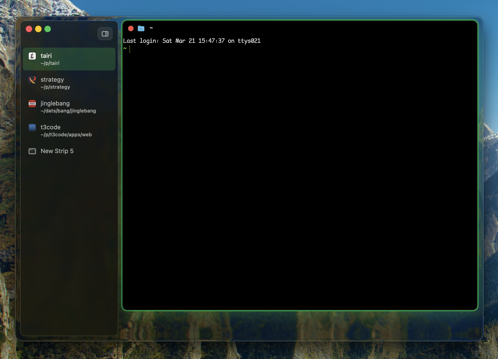
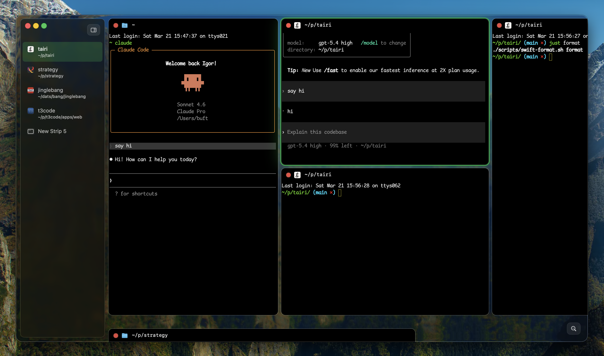
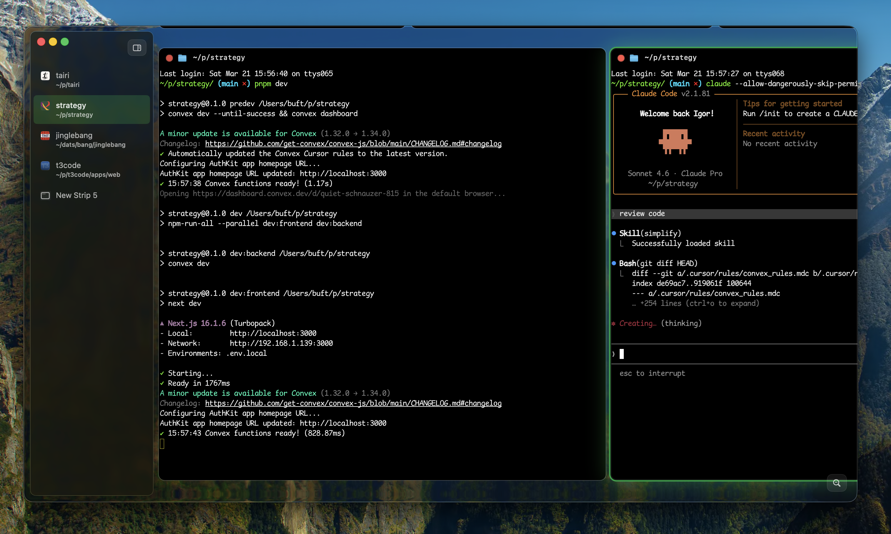
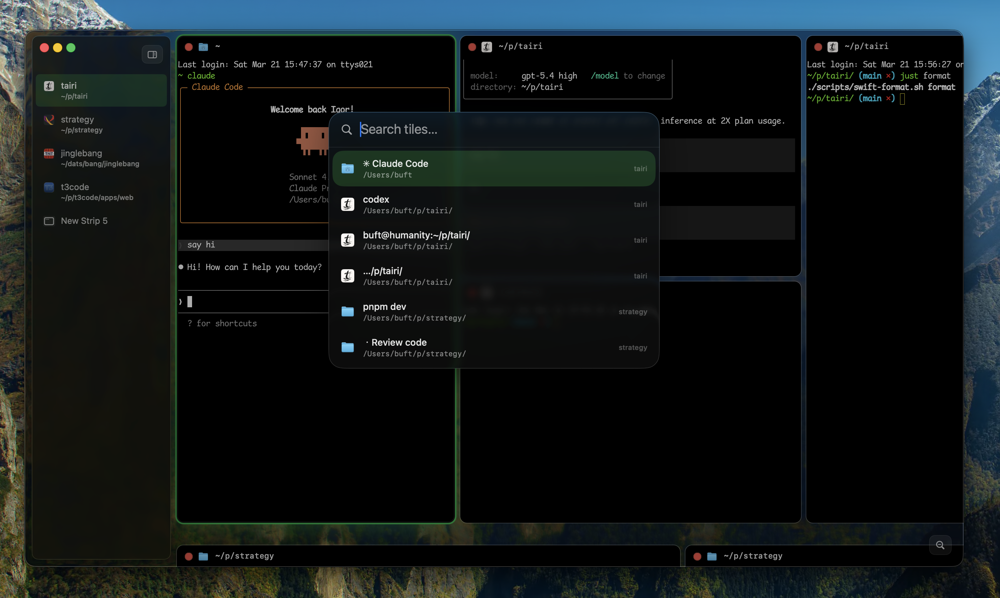

# UI Walkthrough

This is a quick visual tour of Tairi's core UI.

Terminology used in this repo:

- `window`: the app window that contains everything
- `strip`: a horizontal workspace row
- `tile`: a single content tile, usually a Ghostty terminal

## Startup

A fresh window starts with the sidebar on the left and a single active strip on the right.

## Strip Layout

Within a strip, new terminals append horizontally as new tiles instead of shrinking everything into a dense grid. The active tile gets the brighter focus treatment.

## Multiple Strips

The sidebar is the strip switcher. Each row represents one strip and keeps its title and icon visible even while another strip is active.

## Tile Spotlight

Spotlight search gives you a fast way to jump across tiles by title, path, or task context without manually hunting through the window.

## Zoom-Out Overview

Zoom-out compresses the current window into an overview so you can scan the full layout at once and pick the tile you want to focus.

